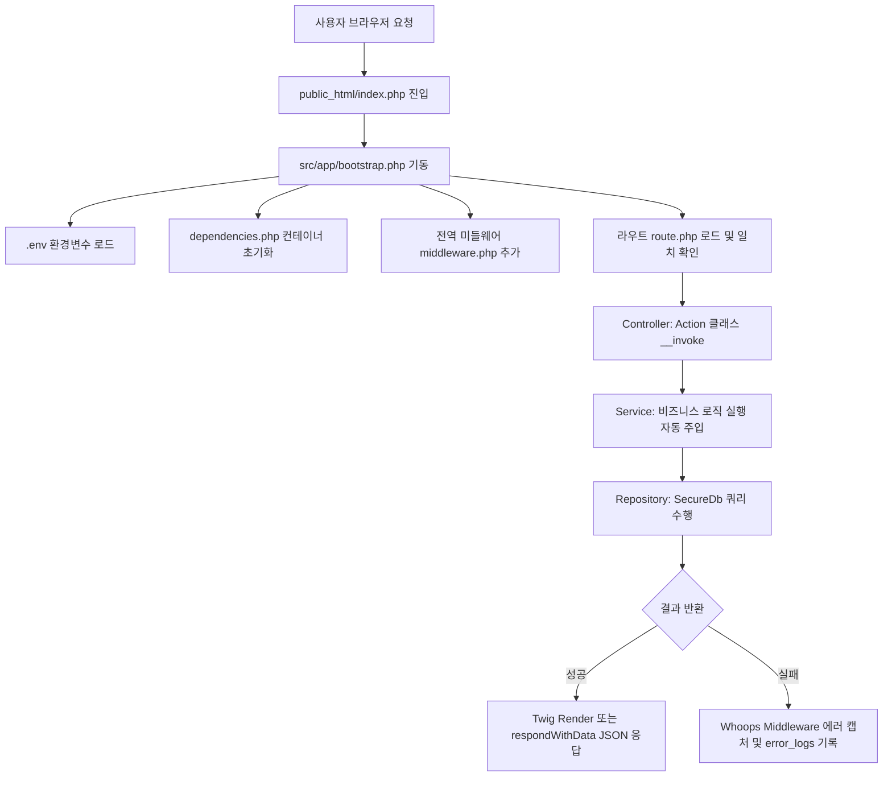
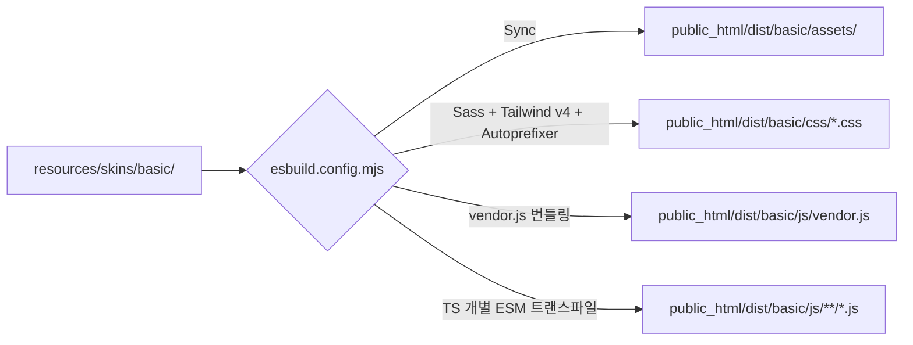

# Domemall 프로젝트 아키텍처 가이드 (Architecture Guide)

본 문서는 **도메몰(Domemall)** 프로젝트의 전체적인 아키텍처 설계, 디렉터리 구조, 그리고 핵심 동작 흐름(Backend & Frontend)을 설명합니다.

---

## 1. 기술 스택 (Technology Stack)

### 1.1 Backend (PHP)
* **Slim Framework (v4.15)**: 가볍고 유연하며 미들웨어 구조의 PSR-7 표준을 준수하는 PHP 마이크로 프레임워크입니다.
* **PHP-DI (v7.1)**: 객체 생성과 종속성 관리를 위해 의존성 주입(Dependency Injection) 컨테이너를 도입했습니다.
* **Twig View (v3.4)**: 비즈니스 로직과 화면 설계를 완벽히 분리하는 템플릿 엔진입니다.
* **Slim CSRF Guard (v1.5)**: Cross-Site Request Forgery 취약점을 차단하기 위한 기본 보안 필터입니다.
* **PHP Dotenv (v5.6)**: 인프라 종속적인 설정을 `.env` 파일로 분리하고 환경변수로 주입합니다.
* **Secure Database (SecureDb)**: 기존 `GusDb`의 SQL Injection 취약점을 원천 차단하기 위해 PDO 기반의 매개변수화된 쿼리(Prepared Statements)를 강제로 적용하는 안전한 DB 래퍼 클래스입니다.
* **보안/유틸리티 (HtmlSanitizer, FileUploader 등)**: 
  * `HtmlSanitizer`: HTML Purifier를 래핑하여 완벽한 화이트리스트 기반 XSS 차단 필터링을 수행합니다.
  * `FileUploader`: 업로드된 파일의 확장자와 MIME 타입을 이중 검증하여 웹쉘 및 악성 코드 업로드를 차단합니다.

### 1.2 Frontend & Build System
* **esbuild (v0.28)**: 매우 강력하고 빠른 속도를 특징으로 하는 프론트엔드 번들러입니다. 상시 변경 감지(Watch) 모드를 탑재하고 있습니다.
* **TypeScript (v6.0)**: 프론트엔드 코드의 견고함과 자동완성을 위해 도입되었으며, 빌드 시 ESM(ESNext) 모듈 단위로 트랜스파일됩니다.
* **PostCSS & TailwindCSS v4**: `@tailwindcss/postcss` 플러그인을 컴포넌트하여 최신 Tailwind v4의 유틸리티 클래스 기반 디자인 시스템을 지원합니다.
* **Sass (SCSS)**: CSS 구조화와 중첩 문법의 이점을 취하기 위해 스타일 원본은 SCSS로 관리됩니다.
* **UI/Libraries**: `jQuery (v4.0)`, `Axios (v1.16)`, `Lodash (v4.18)`, `Toast UI Grid (tui-grid v4.21)` 등을 조합하여 동적 UI를 개발합니다.

---

## 2. 디렉터리 구조 (Directory Structure)

```
domemall/
├── .agents/              # AI 에이전트 규칙, 프로젝트 스킬, 아키텍처 문서
├── .vscode/              # 개발 환경 설정 (VS Code)
├── docs/                 # 설계 문서 및 요구사항 산출물
│   └── sql/              # 프로젝트 DB 스키마
├── node_modules/         # npm 의존성 라이브러리 (분석 금지, package.json 참고)
├── public_html/          # 웹 서버의 Document Root (외부 접근 가능)
│   ├── .htaccess         # Apache URL Rewrite 및 보안 규칙
│   ├── index.php         # 웹 애플리케이션 통합 진입점 (Front Controller)
│   ├── images/           # 공개 이미지 리소스
│   └── dist/             # esbuild에 의해 컴파일/복사된 최종 에셋 (분석 금지)
│       └── basic/        # basic 스킨 전용 컴파일 리소스
│           ├── assets/   # 복사된 폰트, 이미지 등 바이너리 파일
│           ├── css/      # 빌드 및 Minify 완료된 CSS 파일
│           └── js/       # ESM 및 IIFE 규격으로 빌드된 JS 파일
├── resources/            # 프론트엔드 원본 소스 디렉터리
│   └── skins/
│       └── basic/        # basic 스킨의 에셋 원본
│           ├── assets/   # 폰트, 로고 등 정적 에셋 원본
│           ├── css/      # 스타일시트 원본 (Sass/SCSS)
│           └── js/       # 개별 웹 페이지에 탑재되는 TS 소스 및 vendor.ts
│               ├── admin/   # 관리자 화면 TypeScript 소스
│               └── commons/ # 공통 TypeScript 소스
├── scripts/              # 로컬 개발/운영 보조 스크립트
├── src/                  # 애플리케이션의 핵심 소스 디렉터리
│   ├── app/              # 백엔드 초기화 및 핵심 라이프사이클 설정
│   │   ├── bootstrap.php     # 앱 기동 및 DI 컨테이너 결합
│   │   ├── dependencies.php  # 컨테이너 구성요소 정의 (db, view, session, csrf 등)
│   │   └── middleware.php    # 전역 미들웨어 및 통합 에러 로그 핸들러(Whoops)
│   ├── routes/           # HTTP 라우팅 그룹 및 파일 매핑
│   │   ├── admin/        # 관리자 도메인용 하위 라우트 모음
│   │   │   ├── goods.php    # 상품 관리 기능 라우트
│   │   │   ├── member.php   # 회원 관리 기능 라우트
│   │   │   ├── order.php    # 주문 관리 기능 라우트
│   │   │   └── setting.php  # 환경설정 기능 라우트
│   │   ├── common/       # 권한 공통 기능 라우트
│   │   │   └── upload.php   # 공통 업로드 라우트
│   │   └── route.php     # 최상위 라우트 제어기 (관리자/사용자 구분)
│   ├── source/           # PSR-4 Autoload (네임스페이스: App\) 소스
│   │   ├── Controllers/  # HTTP 요청 처리 및 응답 포맷팅 (Presentation Layer)
│   │   │   ├── Actions/  # 공통 컨트롤러 및 Service 자동 주입(매핑) 로직
│   │   │   ├── Admin/    # 관리자 도메인 컨트롤러
│   │   │   └── Common/   # 권한 공통 컨트롤러
│   │   ├── Services/     # 순수 비즈니스 로직 및 트랜잭션 처리 (Business Layer)
│   │   │   ├── Admin/    # 관리자 도메인 서비스
│   │   │   └── Common/   # 권한 공통 서비스
│   │   ├── Repositories/ # SecureDb를 통한 데이터 영속성 관리 (Data Access Layer)
│   │   │   ├── Admin/    # 관리자 도메인 리포지토리
│   │   │   └── Common/   # 권한 공통 리포지토리
│   │   ├── Core/         # DB 래퍼 등 코어 인프라 클래스
│   │   ├── Lib/          # HtmlSanitizer, FileUploader 등 도메인/보안 라이브러리
│   │   ├── Middlewares/  # 특정 라우트에 바인딩되는 미들웨어 (세션 인증 등)
│   │   └── Settings/     # 글로벌 환경 설정 객체 및 상수 정의
│   └── templates/        # 백엔드 UI 템플릿 소스
│       └── basic/        # basic 테마/스킨의 Twig HTML 파일들
│           └── admin/    # 관리자 페이지 등 도메인별 HTML 템플릿 모음
├── todo/                 # 작업 중 임시 산출물 및 확인용 자료
├── vendor/               # Composer에 의해 관리되는 PHP 종속 라이브러리 (분석 금지, composer.json 참고)
├── .editorconfig         # 파일 포맷, 인코딩, 들여쓰기 공통 규칙
├── .env                  # 로컬 환경변수 및 DB 접속 설정
├── .htaccess             # 루트 Apache 접근 제어 및 Rewrite 보조 설정
├── AGENTS.md             # 프로젝트 에이전트 공통 지침
├── composer.json         # PHP 의존성 명세 및 오토로딩 규칙
├── composer.lock         # PHP 의존성 잠금 파일
├── DESIGN.md             # UI/UX 디자인 토큰 및 컴포넌트 기준
├── esbuild.config.mjs    # 프론트엔드 통합 빌드(Asset, CSS, JS) 구성 파일
├── package.json          # Node.js 빌드 라이브러리 명세 및 스크립트
├── package-lock.json     # Node.js 의존성 잠금 파일
├── postcss.config.mjs    # PostCSS 플러그인 연동 정보
├── tailwind.config.js    # TailwindCSS 설정 파일
└── tsconfig.json         # TypeScript 컴파일 상세 설정
```

---

## 3. 백엔드 동작 흐름 (Backend Architecture Flow)

### 3.1 요청의 라이프사이클 (Request Lifecycle)



1. **Front Controller**: 모든 브라우저 요청은 `.htaccess` 설정을 통해 `public_html/index.php`로 유도됩니다.
2. **Bootstrap (`src/app/bootstrap.php`)**:
   * Composer 오토로더 및 `.env` 파일의 비밀 설정을 메모리에 로드합니다.
   * `PHP-DI` 컨테이너 빌더를 생성하고 `dependencies.php`에 등록된 다양한 시스템 컴포넌트(SecureDb, HtmlSanitizer, Twig 뷰 등)를 컨테이너화합니다.
   * Slim App 인스턴스에 전역 미들웨어를 추가하고 라우트 설정을 주입한 뒤 실행(`run()`)합니다.
3. **미들웨어 파이프라인**:
   * 세션 활성화(SameSite 방어) 및 BasePath 인식 필터가 구동됩니다.
   * `Whoops` 에러 핸들러 미들웨어가 등록되어 기동되며, 만약 처리 도중 예외(Exception)가 발생하면 데이터베이스 `error_logs` 테이블에 에러 상세 정보를 안전하게 인서트합니다.
4. **아키텍처 제어 및 응답 (Controller -> Service -> Repository)**:
   * **Controller Layer**: 라우팅 경로에 부합하는 `App\Controllers` 클래스가 호출됩니다. 최상위 `Action` 부모 클래스는 `__invoke()` 단계에서 `HtmlSanitizer`를 이용해 완벽한 XSS 방어를 수행한 뒤 데이터를 Service로 넘깁니다.
   * **Service Layer (자동 매핑)**: `Action` 내부에서 네임스페이스를 역산하여, 해당 컨트롤러와 1:1로 매칭되는 `Service` 클래스를 DI 컨테이너에서 동적으로 가져옵니다. `BaseService`는 순수한 비즈니스 로직만 책임집니다.
   * **Repository Layer (자동 주입)**: `BaseService` 역시 자신의 1:1 매칭 `Repository` 클래스를 동적으로 생성하여 내부 변수(`$this->repo`)에 주입합니다. 모든 데이터베이스 접근은 `SecureDb` 객체를 활용한 Prepared Statements로 이루어져 SQL Injection이 원천 차단됩니다.
   * **응답**: 작업 결과에 따라 `$this->render()`를 통해 Twig 템플릿 파일(`.html`)을 매핑하거나, `$this->respondWithData()`로 규격화된 JSON을 클라이언트에 응답합니다.

---

## 4. 프론트엔드 빌드 흐름 (Frontend Build System)

`esbuild.config.mjs` 파일은 프론트엔드 에셋의 컴파일, 동기화, 트랙킹을 일관되게 주도합니다.



### 4.1 정적 리소스 복제 (Assets Sync)
* 빌드 시작 시 `resources/skins/basic/assets/` 폴더 하위의 폰트, 이미지 파일들을 바이너리 손상 없이 그대로 `public_html/dist/basic/assets/` 타겟 폴더로 강제 복사(`fs.cpSync`)하여 리소스를 동기화합니다.

### 4.2 스타일 파이프라인 (Sass + Tailwind v4)
* 빌드 대상 SCSS 파일(`common`, `admin`, `test`)을 정의하여 Sass 라이브러리로 우선 빌드합니다(중첩 구문 해제).
* 이후 `PostCSS` 프로세서를 가동해 `@tailwindcss/postcss` 및 `autoprefixer`를 결합하여 스타일 처리를 최적화합니다.
* Production(배포) 빌드 시에는 `esbuild.transform`을 활용해 한 차례 더 바짝 압축(Minify)하여 용량을 절감시킵니다.

### 4.3 자바스크립트/타입스크립트 번들링
* **공통 벤더 번들링**: jQuery, Axios, Lodash 같이 무겁고 매번 빌드할 필요가 없는 라이브러리를 하나로 묶어 `vendor.js` IIFE 전역 스크립트로 생성합니다.
* **개별 페이지용 TS 컴파일**: `resources/skins/basic/js/**/*.ts` 내 페이지 스크립트들을 ESM 포맷으로 컴파일하되, `external` 옵션으로 공통 모듈(jQuery, Axios 등)을 빌드 대상에서 제외시켜 컴파일 속도를 수밀리초(ms) 단위로 절감합니다.

### 4.4 상시 감시 모드 (Watch Mode)
* `isWatch`가 참일 때 `esbuild.context`를 기동해 TS 변경을 상시 모니터링합니다.
* 추가적으로 `resources/skins/basic/` 전체에 대해 Node.js 네이티브 `fs.watch`를 구성하여 SCSS 파일이나 Assets 바이너리가 변경될 경우 자동으로 스타일 리빌드 및 리소스 동기화 프로세스를 즉각적으로 수행합니다.


